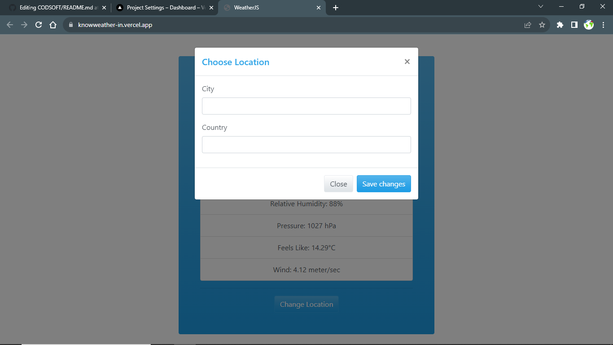
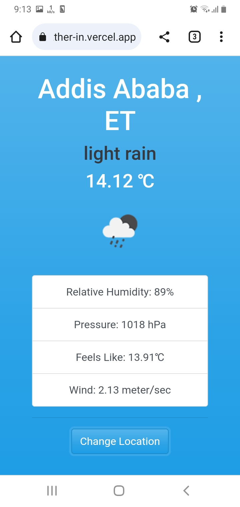

# WeatherJS

Welcome to the Weather Web App repository! This is a simple web application built using JavaScript that allows users to retrieve weather information using the [OpenWeatherMap API](https://api.openweathermap.org).

## Table of Contents

- [Demo](#demo)
- [Features](#features)
- [Contributing](#contributing)
- [License](#license)

## Demo

# Here are sample  screenshot showcasing weather web app in action.

# we can change to the location we want

 

# It is also designed to be responsive for mobile devices

  

## Features

- Retrieve current weather data for a specific city.
- Change to the location we want weather information.
- Display temperature, weather conditions, humidity, and more.
- Responsive design for various screen sizes.

## Contributing
** Contributions are welcome! If you find any issues or want to enhance the app, feel free to open a pull request **

1. Fork the repository.
2. Create a new branch: git checkout -b feature/your-feature-name.
3. Make your changes and commit them: git commit -m 'Add some feature'.
4. Push the changes to your fork: git push origin feature/your-feature-name.
5. Open a pull request explaining your changes.

 ##  License
This project is licensed under the **Apache 2.0 License.**

